<div align="center">

<!-- BOOT SEQUENCE -->


<br/>

<!-- MAIN TITLE -->


<br/>

<!-- STATUS BADGES -->


</div>

---

```
╔══════════════════════════════════════════════════════════════════════╗
â•‘  > whoami                                                            â•‘
â•‘  â–‘â–‘â–‘â–‘â–‘â–‘â–‘â–‘â–‘â–‘â–‘â–‘â–‘â–‘â–‘â–‘â–‘â–‘â–‘â–‘â–‘â–‘â–‘â–‘â–‘â–‘â–‘â–‘â–‘â–‘â–‘â–‘â–‘â–‘â–‘â–‘â–‘â–‘â–‘â–‘â–‘â–‘â–‘â–‘â–‘â–‘â–‘â–‘â–‘â–‘â–‘â–‘â–‘â–‘â–‘â–‘â–‘â–‘â–‘â–‘â–‘â–‘â–‘â–‘  â•‘
â•‘  HANDLE   : L16H7N1N65                                               â•‘
â•‘  CLASS    : Data Engineer  //  Pipeline Architect                    â•‘
║  FOCUS    : ETL · Search Infrastructure · AI/RAG · Distributed Sys  ║
â•‘  MISSION  : Ingest. Transform. Index. Expose. Scale.                 â•‘
╚══════════════════════════════════════════════════════════════════════╝
```

<div align="center">

I design and build systems that **ingest**, **process**, **normalize**, **index**, and **expose**
large volumes of data through scalable, distributed architectures.

</div>

---

<div align="center">


&nbsp;

&nbsp;

&nbsp;


</div>

---

## `>> DATA PIPELINE ARCHITECTURE`

```mermaid
%%{init: {'theme': 'dark', 'themeVariables': { 'primaryColor': '#0d0d0d', 'primaryTextColor': '#00FF41', 'primaryBorderColor': '#00FF41', 'lineColor': '#00FF41', 'secondaryColor': '#0d0d0d', 'tertiaryColor': '#030303', 'edgeLabelBackground': '#030303', 'clusterBkg': '#0d0d0d', 'titleColor': '#00FF41' }}}%%
flowchart LR
    WEB(["🌐 WEB SOURCES\nscrapers / crawlers"])
    ETL(["⚙️ ETL PIPELINE\ntransform / clean"])
    KFK(["📨 KAFKA\nevent streaming"])
    RMQ(["🐇 RABBITMQ\nmessage queue"])
    PRC(["🔧 PROCESSING\nindex / normalize"])
    PG(["🗄️ POSTGRES\npersistent store"])
    SLR(["🔍 SOLR\nsearch index"])
    API(["🚀 API / RAG\nexpose / infer"])

    WEB --> ETL
    ETL --> KFK
    ETL --> RMQ
    KFK --> PRC
    RMQ --> PRC
    PRC --> PG
    PRC --> SLR
    PG  --> API
    SLR --> API
```



---

## `>> GRID STATS`

<div align="center">


&nbsp;


</div>

<div align="center">


</div>

<div align="center">


</div>

---

## `>> TECH STACK`

<div align="center">

**[ DATA ENGINEERING & SEARCH ]**


**[ BACKEND & APIs ]**


**[ FRONTEND ]**


**[ PLATFORM & DEVOPS ]**


</div>

---

## `>> ACTIVE MISSIONS`

<div align="center">

**â—ˆ PROJECT X** &nbsp; 

> Large-scale patent data pipeline — ingestion, normalization, indexing, and search infrastructure at scale.


&nbsp;

**â—ˆ MINDEASE** &nbsp; 

> AI-powered mental health platform — RAG architecture, vector search, LLM interaction, behavioral feedback loops.


&nbsp;

**â—ˆ REAL ESTATE AI PLATFORM** &nbsp; 

> Data-driven property platform — scrapers, valuation algorithms, AI agents, geospatial data pipelines.


&nbsp;

**â—ˆ DATA ETL PIPELINES** &nbsp; 

> High-throughput ingestion — multi-source crawling, stream processing, indexed delivery at **2.4M+ records/day**.


</div>

---

## `>> TROPHIES`

<div align="center">


</div>

---

## `>> NEURAL LINK`

<div align="center">

<a href="mailto:linda.meghouche@gmail.com">

</a>
&nbsp;

<a href="https://www.linkedin.com/in/lindamg/">

</a>

</div>

---

<div align="center">


<br/><br/>


</div>