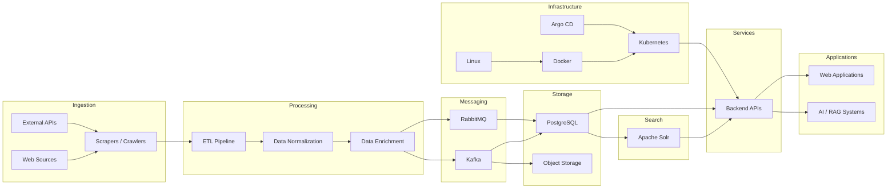
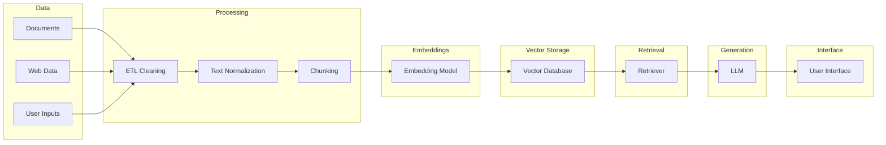

https://github.com/L16H7N1N65/L16H7N1N65/assets/79063770/c0317a1a-fe42-42e7-bb2a-4c90462e030f

 

# ABOUT ME

Data Engineer focused on **data pipelines, ETL systems, search infrastructure, distributed architectures, backend APIs, and AI-driven platforms**.

I design and build systems that ingest, process, normalize, index, and expose large volumes of data through scalable architectures.

Main interests:

- Data Engineering
- Distributed Systems
- Search Infrastructure
- AI & RAG Systems
- Platform Engineering

---

# CONTACT

---

# DATA ENGINEERING & SEARCH

---

# BACKEND & APIs

---

# FRONTEND

---

# DEVOPS & PLATFORM

---

# FEATURED PROJECTS

### Project X
Refactoring and industrialization of a **large-scale patent data pipeline** including ingestion, normalization, indexing, and search infrastructure.

### MindEase
AI-powered **mental health platform** integrating:

- Retrieval-Augmented Generation
- vector search
- LLM interaction
- behavioral feedback loops

### Real Estate AI Platform
Data-driven real estate platform integrating:

- property scrapers
- valuation algorithms
- AI agents
- geospatial data pipelines

### Data ETL Pipelines
Large-scale ingestion pipelines using:

- Scrapy
- Python
- Kafka / RabbitMQ
- PostgreSQL
- Solr indexing

---

# DATA PLATFORM ARCHITECTURE

---

# AI / RAG PIPELINE 

---

# GITHUB STATS

---

# GITHUB ACTIVITY

---

# VISITORS

