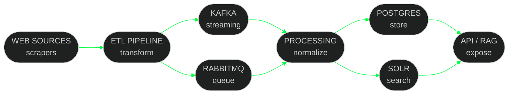

 

 

---

<!-- WHOAMI -->

 

<!-- PIPELINE -->

<!-- STATS -->

<!-- MISSIONS -->

| `â—ˆ PROJECT X` | `â—ˆ MINDEASE` |
|:---|:---|
|  Patent data pipeline — ingestion · normalization · indexing · search |  AI mental health platform — RAG · vector search · LLM · feedback loops |
|     |    |

| `â—ˆ REAL ESTATE AI` | `â—ˆ ETL PIPELINES` |
|:---|:---|
|  Property platform — scrapers · valuation · AI agents · geospatial |  High-throughput ingestion — crawling · stream processing · 2.4M+ rec/day |
|    |     |

---

<!-- TROPHIES -->

---

<!-- CONTACT -->

 

&nbsp;

  

  

